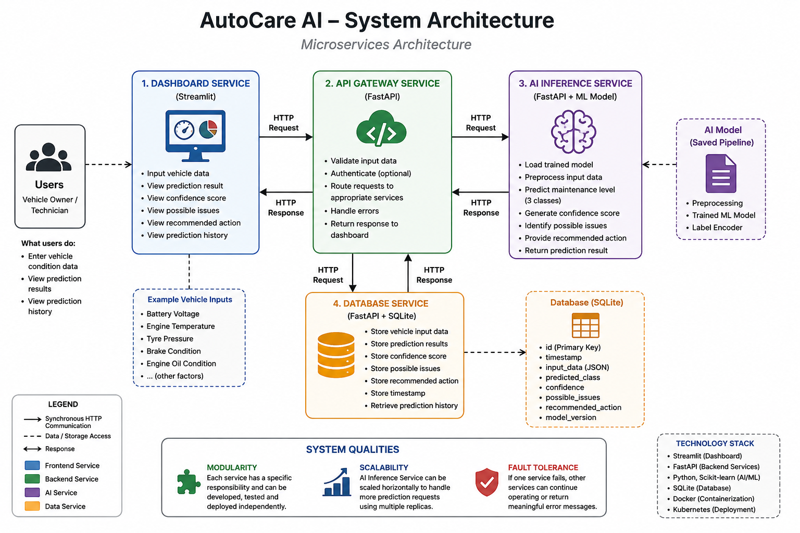

# AutoCare AI - System Architecture Description



## 1. Architecture overview

AutoCare AI is a smart vehicle-maintenance prediction system implemented as four independent microservices:

1. Dashboard Service
2. API Gateway Service
3. AI Inference Service
4. Database Service

The system predicts one of the three maintenance classes learned from the dataset:

- `Safe for Driving`
- `At Risk`
- `Needs Immediate Maintenance`

Each service has one primary responsibility and communicates through HTTP. This separation improves modularity, scalability and maintainability while allowing failures to be handled at the service boundary.

The prediction flow is:

```text
User -> Dashboard -> API Gateway -> AI Inference
                                -> Database
     <- Dashboard <- API Gateway
```

Prediction history follows:

```text
Dashboard -> API Gateway -> Database -> API Gateway -> Dashboard
```

The Dashboard communicates only with the API Gateway. It does not directly access the trained model or SQLite database.

## 2. Vehicle telemetry contract

The Dashboard, API Gateway, AI Inference Service and Database Service use the same ten telemetry fields:

- `Car_Model`
- `Vehicle_Age_Years`
- `Total_Mileage_KM`
- `Tire_Pressure_PSI`
- `Engine_RPM`
- `Battery_Voltage_V`
- `Fuel_Level_Percent`
- `Coolant_Temperature_C`
- `Brake_Pad_Thickness_mm`
- `O2_Sensor_Voltage_V`

The API Gateway validates numeric limits before forwarding a request to the AI Inference Service. The Database Service applies the same telemetry limits when it receives a completed prediction record.

## 3. Dashboard Service

- **Technology:** Streamlit and Requests
- **Application port:** `8501`

The Dashboard Service provides the user interface for vehicle owners, maintenance technicians, workshop staff and fleet operators.

### Responsibilities

- Collect the ten vehicle telemetry inputs.
- Send prediction requests only to `POST /predict` on the API Gateway.
- Display the exact `maintenance_decision` returned by the API.
- Display the confidence score and identified issues.
- Use success, warning or error presentation for the three actual model classes.
- Request prediction history from `GET /history` on the API Gateway.
- Display readable timeout, connection, HTTP and response-validation errors.

The Dashboard does not generate, replace or remap predictions. Unknown future decision labels are displayed neutrally without changing the returned value.

## 4. API Gateway Service

- **Technology:** FastAPI and HTTPX
- **Application and Kubernetes service port:** `8000`

The API Gateway is the controlled communication point between the Dashboard, AI Inference Service and Database Service.

### Implemented endpoints

- `POST /predict` - validate telemetry, request an AI prediction and attempt to store the completed result.
- `GET /history` - retrieve stored prediction records from the Database Service.

### Prediction request behaviour

1. The Gateway validates the submitted telemetry using its Pydantic schema.
2. It sends the validated telemetry to `POST /predict` on the AI Inference Service.
3. It receives the AI response containing `maintenance_decision`, `confidence_score`, `identified_issues` and `status`.
4. It sends the telemetry and prediction result to `POST /records` on the Database Service.
5. It returns the original AI response to the Dashboard without hard-coding or remapping the decision.

The service URLs are configured through `AI_SERVICE_URL` and `DATABASE_SERVICE_URL`. In Kubernetes they are:

- `http://ai-inference-service:8001`
- `http://database-service:8000`

If the AI service times out, is unavailable, returns an error or returns invalid JSON, the Gateway returns an appropriate HTTP gateway error. A Database storage failure is logged without replacing a valid AI prediction. History requests return an error if the Database Service cannot be reached.

## 5. AI Inference Service

- **Technology:** FastAPI, pandas, scikit-learn and Joblib
- **Application and Kubernetes service port:** `8001`

The AI Inference Service loads the saved Random Forest preprocessing and classification pipeline from `vehicle_maintenance_model.pkl` when the application starts.

### Implemented endpoints

- `GET /` - return basic service status and the documentation path.
- `GET /health` - confirm that the service is healthy and the model is loaded.
- `POST /predict` - generate a maintenance prediction from validated telemetry.

### Responsibilities

- Apply the saved categorical and numerical preprocessing pipeline.
- Predict one of the three trained maintenance classes.
- Calculate the confidence score from the highest predicted class probability.
- Identify understandable telemetry issues using the submitted readings.
- Return the prediction result to the API Gateway.

The returned response contains:

- `maintenance_decision`
- `confidence_score`
- `identified_issues`
- `status`

The maintenance decision comes from the trained model. The identified issues provide supporting telemetry observations and do not replace the model prediction.

## 6. Database Service

- **Technology:** FastAPI, SQLite and Pydantic
- **Application and Kubernetes service port:** `8000`

The Database Service stores and retrieves prediction history. SQLite is isolated behind the service API, so other services never access the database file directly.

### Implemented endpoints

- `GET /` - return basic service status and the documentation path.
- `GET /health` - confirm that SQLite can execute a database query.
- `POST /records` - store a complete prediction record.
- `GET /records` - return all prediction records, newest first.
- `GET /records/{record_id}` - return one record or HTTP 404 when it does not exist.

### Stored record fields

- `id`
- `timestamp`
- `input_data`
- `maintenance_decision`
- `confidence_score`
- `identified_issues`
- `recommendation` (optional)
- `model_version` (optional)

The `maintenance_decision` is stored exactly as received. The Database Service does not restrict it to a fixed class list and does not remap it.

The database path is configured through `DATABASE_PATH`. Kubernetes sets the path to `/data/autocare.db` and mounts persistent storage at `/data`.

## 7. End-to-end data flow

### Prediction

1. A user enters telemetry in the Dashboard.
2. The Dashboard sends the exact telemetry JSON to the API Gateway.
3. The Gateway validates the request.
4. The Gateway forwards valid telemetry to the AI Inference Service.
5. The AI service applies the saved preprocessing pipeline and model.
6. The AI service returns the actual prediction, confidence score and identified issues.
7. The Gateway submits the completed record to the Database Service.
8. The Database stores the telemetry and prediction without remapping the decision.
9. The Gateway returns the AI response to the Dashboard.
10. The Dashboard displays the returned decision and supporting information.

### Prediction history

1. The Dashboard requests `GET /history` from the API Gateway.
2. The Gateway requests `GET /records` from the Database Service.
3. The Database returns records in newest-first order.
4. The Gateway returns the records to the Dashboard.
5. The Dashboard displays the history as a table.

## 8. Modularity and maintainability

Each service has a separate source directory, dependency file and Dockerfile:

- Dashboard: user interaction and presentation.
- API Gateway: validation and service coordination.
- AI Inference: preprocessing and prediction.
- Database: persistent prediction history.

This separation allows one service to be updated or rebuilt without combining its implementation with another service. Environment variables provide deployment-specific service locations, while the HTTP contracts remain consistent.

The trained preprocessing steps and classifier are saved together as one pipeline, preventing training-time and inference-time preprocessing from diverging.

## 9. Scalability

The AI Inference Service is the selected horizontal-scaling target because prediction work is more computationally intensive than the Dashboard or Database operations.

The Kubernetes manifest deploys three AI Inference replicas. The `ai-inference-service` ClusterIP Service distributes Gateway requests across the available pods. Other services remain at one replica because they do not require the same processing capacity for this demonstration.

Scaling is performed manually with `kubectl scale`. A metrics-based HorizontalPodAutoscaler is not currently configured.

## 10. Fault tolerance and persistence

The implemented system includes the following failure-handling measures:

- The Gateway applies finite connection and request timeouts when calling internal services.
- AI communication failures are translated into HTTP 502, 503 or 504 responses as appropriate.
- Dashboard request failures are converted into readable user-facing messages instead of uncaught application errors.
- The AI Inference, Database and Dashboard Kubernetes deployments use readiness and liveness probes.
- Kubernetes can restart unhealthy containers and stop routing traffic to pods that are not ready.
- Three AI replicas prevent a single AI pod failure from removing all inference capacity.
- The Database uses a 1 Gi PersistentVolumeClaim, so records survive Database pod replacement.

The Database remains a single replica because SQLite and its ReadWriteOnce volume are not intended for concurrent multi-replica writes. The current API Gateway manifest does not include readiness or liveness probes.

## 11. Docker and Kubernetes deployment

All four services have independent Dockerfiles and public versioned container images. Kubernetes provides one Deployment and one Service for each microservice.

| Service | Kubernetes Service | Service type | Port | Replicas |
|---|---|---|---:|---:|
| Dashboard | `dashboard-service` | NodePort | 8501 | 1 |
| API Gateway | `api-gateway-service` | ClusterIP | 8000 | 1 |
| AI Inference | `ai-inference-service` | ClusterIP | 8001 | 3 |
| Database | `database-service` | ClusterIP | 8000 | 1 |

The Dashboard is the only externally exposed application service. The Gateway, AI Inference and Database services remain internal ClusterIP services. The API Gateway and Database can both use port `8000` because they have different Kubernetes service names and cluster addresses.

## 12. Technology stack

| Component | Implemented technology |
|---|---|
| Dashboard Service | Streamlit, pandas and Requests |
| API Gateway Service | FastAPI, Pydantic and HTTPX |
| AI Inference Service | FastAPI, pandas, scikit-learn and Joblib |
| Database Service | FastAPI, Pydantic and SQLite |
| Programming language | Python |
| Model | Random Forest classification pipeline |
| Containerisation | Docker |
| Container registry | Docker Hub |
| Orchestration | Kubernetes using Minikube |
| Persistent storage | Kubernetes PersistentVolumeClaim |
| Version control | Git and GitHub |

## 13. Current deployment limitations

- Minikube is a local development cluster rather than a production deployment.
- AI scaling is manual; no HorizontalPodAutoscaler is configured.
- SQLite is intentionally limited to one Database replica.
- The API Gateway does not currently have Kubernetes readiness or liveness probes.
- The system uses synchronous HTTP request flows and does not include a message queue.

These limitations are appropriate for the current project scope and are documented so that future production improvements can be evaluated without changing the demonstrated architecture.
